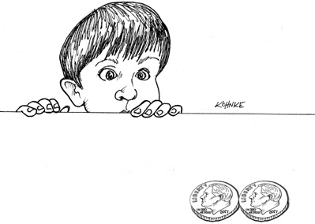

# Chap3. PARADIGM OVERVIEW 编程范式总览

The three paradigms included in this overview chapter are structured programming, object-orient programming, and functional programming.

> 本章将讲述三个编程范式，它们分别是结构化编程（structured programming）、 面向对象编程（object-oriented programming）以及函数式编程（functional programming）。

## STRUCTURED PROGRAMMING 结构化编程

The first paradigm to be adopted (but not the first to be invented) was structured programming, which was discovered by Edsger Wybe Dijkstra in 1968. Dijkstra showed that the use of unrestrained jumps (goto statements) is harmful to program structure. As we’ll see in the chapters that follow, he replaced those jumps with the more familiar if/then/else and do/while/until constructs.

> 结构化编程是第一个普遍被采用的编程范式（但是却不是第一个被提出的），由 Edsger Wybe Dijkstra 于 1968 年最先提出。与此同时，Dijkstra 还论证了使用 goto 这样的无限制跳转语句将会损害程序的整体结构。接下来的章节我们还会说到，二是这位 Dijkstra 最先主张用我们现在熟知的 if/then/else 语句和 do/while/until 语句来代替跳转语句的。

We can summarize the structured programming paradigm as follows:

> 我们可以将结构化编程范式归结为一句话：

Structured programming imposes discipline on direct transfer of control.

> 结构化编程对程序控制权的直接转移进行了限制和规范。

## OBJECT-ORIENTED PROGRAMMING 面向对象编程

The second paradigm to be adopted was actually discovered two years earlier, in 1966, by Ole Johan Dahl and Kristen Nygaard. These two programmers noticed that the function call stack frame in the ALGOL language could be moved to a heap, thereby allowing local variables declared by a function to exist long after the function returned. The function became a constructor for a class, the local variables became instance variables, and the nested functions became methods. This led inevitably to the discovery of polymorphism through the disciplined use of function pointers.

> 说到编程领域中第二个被广泛采用的编程范式，当然就是面向对象编程了：事实上，这个编程范式的提出比结构化编程还早了两年，是在 1966 年由 Ole Johan Dahl 和 Kriste Nygaard 在论文中总结归纳出来的。这两个程序员注意到在 ALGOL 语言中. 函数调用堆栈（call stack frame）可以被挪到堆内存区域里，这样函数定义的本地变量就可以在函数返回之后继续存在。这个函数就成为了一个类（class）的构造函数，而它所定义的本地变量就是类的成员变量，构造函数定义的嵌套函数就成为了成员方法（method）。这样一来，我们就可以利用多态（polymorphism）来限制用户对函数指针的使用。

We can summarize the object-oriented programming paradigm as follows:

> 在这里，我们也可以用一句话来总结面向对象编程：

Object-oriented programming imposes discipline on indirect transfer of control.

> 面向对象编程对程序控制权的间接转移进行了限制和规范。

## FUNCTIONAL PROGRAMMING 函数式编程

The third paradigm, which has only recently begun to be adopted, was the first to be invented. Indeed, its invention predates computer programming itself. Functional programming is the direct result of the work of Alonzo Church, who in 1936 invented l-calculus while pursuing the same mathematical problem that was motivating Alan Turing at the same time. His l-calculus is the foundation of the LISP language, invented in 1958 by John McCarthy. A foundational notion of l-calculus is immutability—that is, the notion that the values of symbols do not change. This effectively means that a functional language has no assignment statement. Most functional languages do, in fact, have some means to alter the value of a variable, but only under very strict discipline.

> 尽管第三个编程范式是近些年才刚刚开始被采用的，但它其实是三个范式中最先被发明的。事实上，函数式编程概念是基于与阿兰·图灵同时代的数学家 Alonzo Church 在 1936 年发明的入演算的直接衍生物。1958 年 John Mccarthy 利用其作为基础发明了 LISP 语言。众所周知，λ 演算法的一个核心思想是不可变性——某个符号所对应的值是永远不变的，所以从理论上来说，函数式编程语言中应该是没有赋值语句的。大部分函数式编程语言只允许在非常严格的限制条件下，才可以更改某个变量的值。

We can summarize the functional programming paradigm as follows:

> 因此，我们在这里可以将函数式编程范式总结为下面这句话：

Functional programming imposes discipline upon assignment.

> 函数式编程对程序中的赋值进行了限制和规范。

## FOOD FOR THOUGHT 仅供思考

Notice the pattern that I’ve quite deliberately set up in introducing these three programming paradigms: Each of the paradigms removes capabilities from the programmer. None of them adds new capabilities. Each imposes some kind of extra discipline that is negative in its intent. The paradigms tell us what not to do, more than they tell us what to do.

> 如你所见，我在介绍三个编程范式的时候，有意采用了上面这种格式，目的是凸显每个编程范式的实际含义——它们都从某一方面限制和规范了程序员的能力。没有一个范式是增加新能力的。也就是说，每个编程范式的目的都是设置限制。这些范式主要是为了告诉我们不能做什么，而不是可以做什么。

Another way to look at this issue is to recognize that each paradigm takes something away from us. The three paradigms together remove goto statements, function pointers, and assignment. Is there anything left to take away?

> 另外，我们应该认识到，这三个编程范式分别限制了 goto 语句、函数指针和赋值语句的使用。那么除此之外，还有什么可以去除的吗？

Probably not. Thus these three paradigms are likely to be the only three we will see—at least the only three that are negative. Further evidence that there are no more such paradigms is that they were all discovered within the ten years between 1958 and 1968. In the many decades that have followed, no new paradigms have been added.

> 可能没有了。因此这三个编程范式可能是仅有的三个了——如果单论去除能力的编程范式的话。支撑这一结论的另外一个证据是，三个编程范式都是在 1958 年到 1968 年这 10 年间被提出来的，后续再也没有新的编程范式出现过。

## CONCLUSION 本章小结

What does this history lesson on paradigms have to do with architecture? Everything. We use polymorphism as the mechanism to cross architectural boundaries; we use functional programming to impose discipline on the location of and access to data; and we use structured programming as the algorithmic foundation of our modules.

> 大家可能会问，这些编程范式的历史知识与软件架构有关系吗？当然有，而目关系相当密切。譬如说，多态是我们跨越架构边界的手段，函数式编程是我们规范和限制数据存放位置与访问权限的手段，结构化编程则是各模块的算法实现基础。

Notice how well those three align with the three big concerns of architecture: function, separation of components, and data management.

> 这和软件架构的三大关注重点不谋而合：功能性、组件独立性以及数据管理。

# kimi

艾兹格·迪科斯彻（Edsger Wybe Dijkstra）是结构化编程的先驱之一，他通过数学方法证明了顺序、选择和迭代控制结构的正确性，从而证明了结构化编程的可行性和优越性。以下是他如何证明这三种基本控制结构的正确性：

1. **顺序控制结构（Sequence）**：
   - 顺序控制结构是最简单的控制结构，它指的是程序按照代码的顺序依次执行。
   - 迪科斯彻展示了顺序语句可以通过简单的枚举法证明其正确性。这种方法与其他正常的数学证明过程相似，即对序列中的每个输入，跟踪其对应的输出值的变化，从而证明程序的每一步都是按照预期执行的。

2. **选择控制结构（Selection）**：
   - 选择控制结构涉及到基于条件选择不同的执行路径，例如“if-then-else”语句。
   - 迪科斯彻通过重新应用枚举法来证明选择结构的正确性。对于选择结构中的每条可能的路径，都进行枚举，如果所有路径都能产生适当的数学结果，那么整个选择结构就是正确的。

3. **迭代控制结构（Iteration）**：
   - 迭代控制结构涉及到重复执行一段代码，直到满足某个条件，例如“do-while”或“for”循环。
   - 迪科斯彻使用数学归纳法来证明迭代结构的正确性。首先，他用枚举法证明迭代1次的情况是正确的。然后，他假设迭代N次是正确的，并证明如果这个假设成立，那么迭代N+1次也是正确的。最后，他还用枚举法证明了循环结构的起始与结束条件的正确性。

迪科斯彻的这些证明非常重要，因为它们表明了结构化编程的控制结构集与构建所有程序所需的控制结构集的最小集是等同的。这意味着，使用这些基本控制结构，我们可以构建出任何程序，并且这些程序都可以被证明是正确的。这种证明不仅提高了程序的可读性和可维护性，而且也使得程序的验证和验证变得更加可行。

迪科斯彻的这些工作为结构化编程奠定了理论基础，并且对后来的编程语言设计和软件开发实践产生了深远的影响。通过避免使用“goto”这样的无条件跳转语句，程序员可以编写出结构更加清晰、逻辑更加明确的程序，从而提高程序的质量和可靠性。

这段内容讲述的是结构化编程（Structured Programming）的核心概念。结构化编程是一种编程范式，它对程序中控制权的直接转移进行了限制和规范。这里的“直接转移”主要指的是像`goto`这样的无条件跳转语句，它们允许程序的执行流程在代码中任意跳转，从而可能导致程序的流程难以理解和维护。

结构化编程的主要观点是，程序应该由一系列顺序执行的语句块组成，这些语句块之间通过顺序、选择（如`if/then/else`）和迭代（如`do/while/until`）等控制结构来连接，而不是通过`goto`语句。这种范式强调程序的流程应该是清晰和有序的，以提高代码的可读性和可维护性。

Edsger Wybe Dijkstra在1968年提出结构化编程的概念，并指出无限制的`goto`语句会损害程序的结构。他主张用更熟悉的控制结构来替代`goto`语句，从而使得程序的结构更加清晰，逻辑更加连贯。这种范式后来成为现代编程语言设计的基础，大多数现代编程语言都遵循了这一原则，限制或完全移除了`goto`语句的使用。
