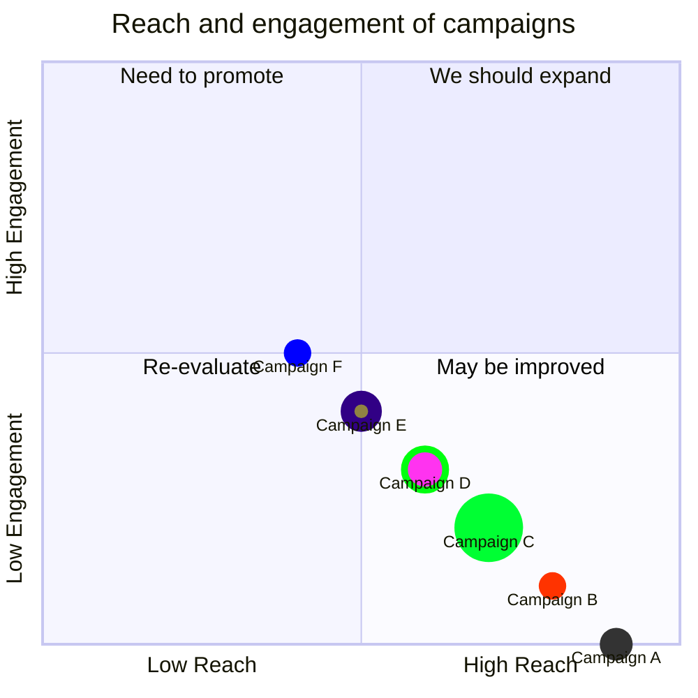
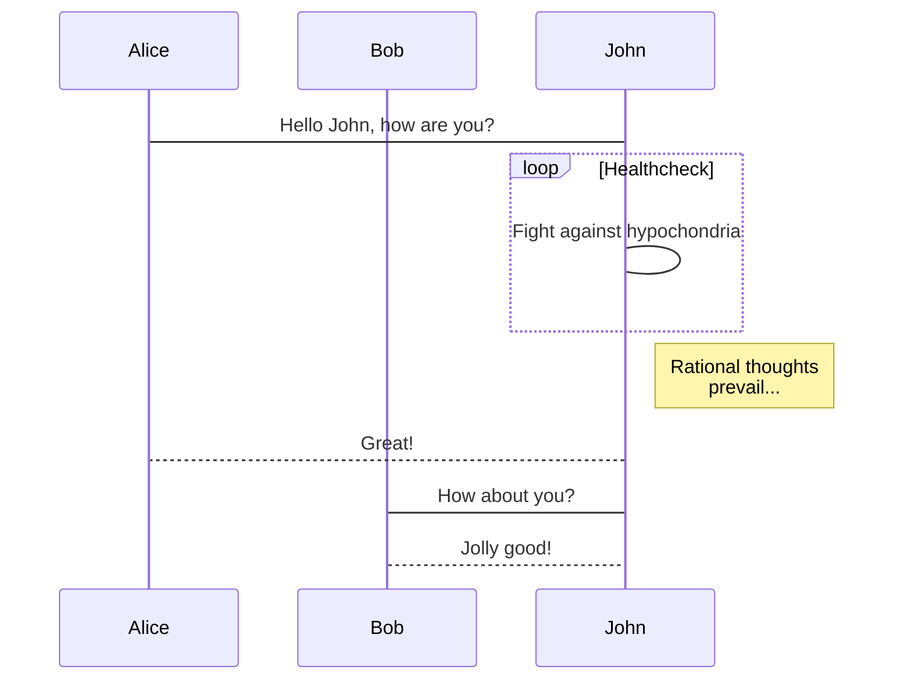
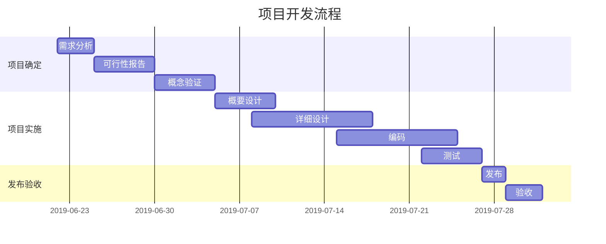
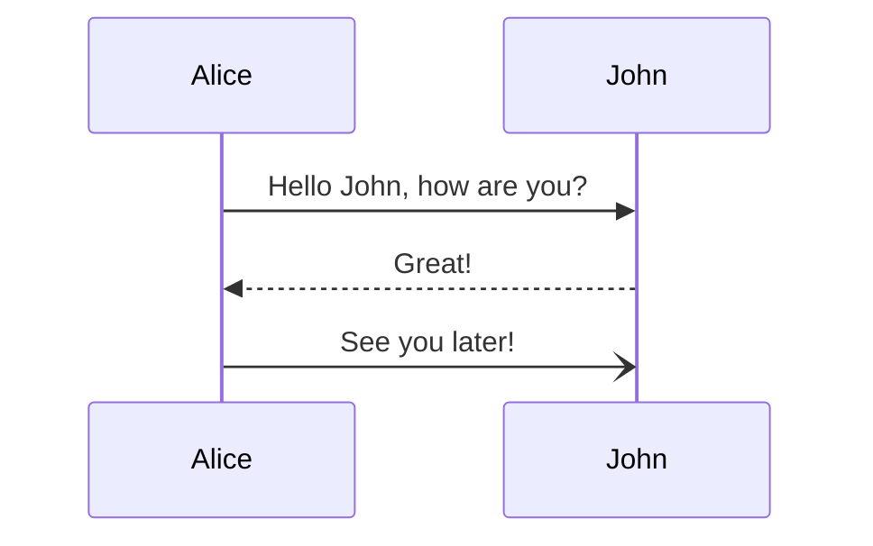
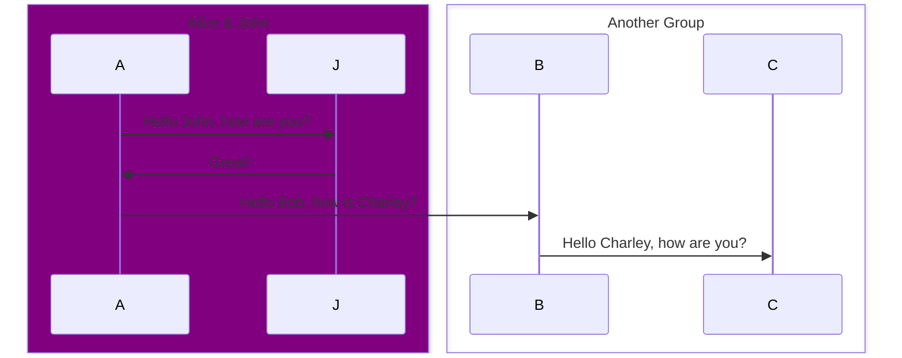
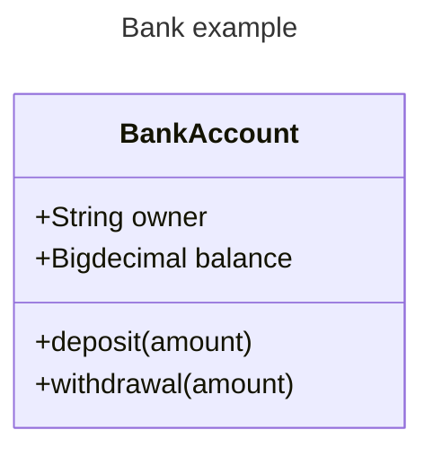

# 欢迎使用 `Arya` 在线 Markdown 编辑器



[Arya](https://markdown.lovejade.cn/?ref=markdown.lovejade.cn)，是一款基于 `Vue`、`Vditor`，为未来而构建的在线 Markdown 编辑器；轻量且强大：内置粘贴 HTML 自动转换为 Markdown，支持流程图、甘特图、时序图、任务列表，可导出携带样式的图片、PDF、微信公众号特制的 HTML 等等。

---

## 如何使用

**微注**：清空目前这份默认文档，即处于可使用态。[Arya](https://markdown.lovejade.cn/?ref=markdown.lovejade.cn) 另一大优点在于：编辑内容只会在您本地进行保存，不会上传您的数据至服务器，**绝不窥测用户个人隐私，可放心使用**；Github 源码：[markdown-online-editor](https://github.com/nicejade/markdown-online-editor)，部分功能仍在开发🚧，敬请期待。

默认为[所见即所得](https://hacpai.com/article/1577370404903?ref=github.com)模式，可通过 `⌘-⇧-M`（`Ctrl-⇧-M`）进行切换；或通过以下方式：

- 所见即所得：`⌘-⌥-7`（`Ctrl-alt-7`）；
- 即时渲染：`⌘-⌥-8`（`Ctrl-alt-8`）；
- 分屏渲染：`⌘-⌥-9`（`Ctrl-alt-9`）；

### PPT 预览

如果您用作 `PPT` 预览（入口在`设置`中），需要注意，这里暂还不能支持各种图表的渲染；您可以使用 `---` 来定义水平方向上幻灯片，用 `--` 来定义垂直幻灯片；更多设定可以参见 [RevealJs 文档](https://github.com/hakimel/reveal.js#table-of-contents)。

---

## 什么是 Markdown

`Markdown` 是一种方便记忆、书写的纯文本标记语言，用户可以使用这些标记符号，以最小的输入代价，生成极富表现力的文档：譬如您正在阅读的这份文档。它使用简单的符号标记不同的标题，分割不同的段落，**粗体**、*斜体* 或者[超文本链接](https://vue-cli3.lovejade.cn/explore/)，更棒的是，它还可以：

---

### 1. 制作待办事宜 `Todo` 列表

- [x] 🎉 通常 `Markdown` 解析器自带的基本功能；
- [x] 🍀 支持**流程图**、**甘特图**、**时序图**、**任务列表**；
- [x] 🏁 支持粘贴 HTML 自动转换为 Markdown；
- [x] 💃🏻 支持插入原生 Emoji、设置常用表情列表；
- [x] 🚑 支持编辑内容保存**本地存储**，防止意外丢失；
- [x] 📝 支持**实时预览**，主窗口大小拖拽，字符计数；
- [x] 🛠 支持常用快捷键(**Tab**)，及代码块添加复制
- [x] ✨ 支持**导出**携带样式的 PDF、PNG、JPEG 等；
- [x] ✨ 升级 Vditor，新增对 `echarts` 图表的支持；
- [x] 👏 支持检查并格式化 Markdown 语法，使其专业；
- [x] 🦑 支持五线谱、及[部分站点、视频、音频解析](https://github.com/b3log/vditor/issues/117?ref=hacpai.com#issuecomment-526986052)；
- [x] 🌟 增加对**所见即所得**编辑模式的支持(`⌘-⇧-M`)；

---

### 2. 书写一个质能守恒公式[^LaTeX]

$$
E=mc^2
$$

---

### 3. 高亮一段代码[^code]

```js
// 给页面里所有的 DOM 元素添加一个 1px 的描边（outline）;
[].forEach.call($$("*"),function(a){
  a.style.outline="1px solid #"+(~~(Math.random()*(1<<24))).toString(16);
})
```

### 4. 高效绘制[流程图](https://github.com/knsv/mermaid#flowchart)


### 5. 高效绘制[序列图](https://github.com/knsv/mermaid#sequence-diagram)



### 6. 高效绘制[甘特图](https://github.com/knsv/mermaid#gantt-diagram)

> **甘特图**内在思想简单。基本是一条线条图，横轴表示时间，纵轴表示活动（项目），线条表示在整个期间上计划和实际的活动完成情况。它直观地表明任务计划在什么时候进行，及实际进展与计划要求的对比。



### 7. 支持图表

```echarts
{
  "backgroundColor": "#212121",
  "title": {
    "text": "「晚晴幽草轩」访问来源",
    "subtext": "2019 年 6 月份",
    "x": "center",
    "textStyle": {
      "color": "#f2f2f2"
    }
  },
  "tooltip": {
    "trigger": "item",
    "formatter": "{a} <br/>{b} : {c} ({d}%)"
  },
  "legend": {
    "orient": "vertical",
    "left": "left",
    "data": [
      "搜索引擎",
      "直接访问",
      "推荐",
      "其他",
      "社交平台"
    ],
    "textStyle": {
      "color": "#f2f2f2"
    }
  },
  "series": [
    {
      "name": "访问来源",
      "type": "pie",
      "radius": "55%",
      "center": [
        "50%",
        "60%"
      ],
      "data": [
        {
          "value": 10440,
          "name": "搜索引擎",
          "itemStyle": {
            "color": "#ef4136"
          }
        },
        {
          "value": 4770,
          "name": "直接访问"
        },
        {
          "value": 2430,
          "name": "推荐"
        },
        {
          "value": 342,
          "name": "其他"
        },
        {
          "value": 18,
          "name": "社交平台"
        }
      ],
      "itemStyle": {
        "emphasis": {
          "shadowBlur": 10,
          "shadowOffsetX": 0,
          "shadowColor": "rgba(0, 0, 0, 0.5)"
        }
      }
    }
  ]
}
```

> **备注**：上述 echarts 图表📈，其数据，须使用严格的 **JSON** 格式；您可使用 JSON.stringify(data)，将对象传换从而得标准数据，即可正常使用。

### 8. 绘制表格

| 作品名称  | 在线地址                                                                                 | 上线日期       |
|:----- |:------------------------------------------------------------------------------------ |:----------:|
| 逍遥自在轩 | [https://niceshare.site](https://niceshare.site/?ref=markdown.lovejade.cn)           | 2024-04-26 |
| 玉桃文飨轩 | [https://share.lovejade.cn](https://share.lovejade.cn/?ref=markdown.lovejade.cn)     | 2022-08-26 |
| 缘知随心庭 | [https://fine.niceshare.site](https://fine.niceshare.site/?ref=markdown.lovejade.cn) | 2022-02-26 |
| 静轩之别苑 | [http://quickapp.lovejade.cn](http://quickapp.lovejade.cn/?ref=markdown.lovejade.cn) | 2019-01-12 |
| 晚晴幽草轩 | [https://www.jeffjade.com](https://www.jeffjade.com/?ref=markdown.lovejade.cn)       | 2014-09-20 |

### 9. 更详细语法说明

想要查看更详细的语法说明，可以参考这份 [Markdown 资源列表](https://github.com/nicejade/nice-front-end-tutorial/blob/master/tutorial/markdown-tutorial.md)，涵盖入门至进阶教程，以及资源、平台等信息，能让您对她有更深的认知。

总而言之，不同于其它*所见即所得*的编辑器：你只需使用键盘专注于书写文本内容，就可以生成印刷级的排版格式，省却在键盘和工具栏之间来回切换，调整内容和格式的麻烦。**Markdown 在流畅的书写和印刷级的阅读体验之间找到了平衡。** 目前它已经成为世界上最大的技术分享网站 `GitHub` 和 技术问答网站 `StackOverFlow` 的御用书写格式，而且越发流行，正在在向各行业渗透。

最新更新于 2019.08.21

# Languages

## Bundled Languages

Language grammars listed below are re-distributed via [`tm-grammars`](https://github.com/shikijs/textmate-grammars-themes/tree/main/packages/tm-grammars) into the `shiki` package.

<LanguagesList />

Grammars are covered by their repositories’ respective licenses, which are permissive (apache-2.0, mit, etc), and made available in [this NOTICE](https://github.com/shikijs/textmate-grammars-themes/blob/main/packages/tm-grammars/NOTICE).

For loading your custom languages, please reference to [this guide](/guide/load-lang).

## Special Languages

### Plain Text

You can set lang to `text` to bypass highlighting. This is useful as the fallback when you receive user specified language that are not available. For example:

```txt
import { codeToHtml } from 'shiki'

const html = codeToHtml('console.log("Hello World")', {
  lang: 'text', // [!code hl]
  theme: 'vitesse-light', 
})
```

`txt`, `plain` are provided as aliases to `text` as well.

### ANSI

A special processed language `ansi` is provided to highlight terminal outputs. For example:

```ansi
┌  Welcome to VitePress!
│
◇  Where should VitePress initialize the config?
│  ./docs
│
◇  Site title:
│  My Awesome Project
│
◇  Site description:
│  A VitePress Site
│
◆  Theme:
│  ● Default Theme (Out of the box, good-looking docs)
│  ○ Default Theme + Customization
│  ○ Custom Theme
└
```

Check the [raw markdown of code snippet above](https://github.com/shikijs/shiki/blob/main/docs/languages.md?plain=1#L35).

```tsx
import { useFloating } from "@floating-ui/react";

function MyComponent() {
  const { refs, floatingStyles } = useFloating();

  return (
    <>
      <div ref={refs.setReference} />
      <div ref={refs.setFloating} style={floatingStyles} />
    </>
  );
}
```

```js
const [age, setAge] = useState(50);
const [name, setName] = useState("Taylor");
```

This is an array `[1, 2, 3]{:js}` of numbers 1 through 3.

The name of the function is `getStringLength{:.entity.name.function}`.

```js
const [age, setAge] = useState(50);
const [name, setName] = useState("Taylor");
```

## transformer

transformerNotationDiff

```ts
console.log('hewwo') // [!code --]
console.log('hello') // [!code ++]
console.log('goodbye')
```

transformerNotationHighlight

```ts
console.log('Not highlighted')
console.log('Highlighted') // [!code highlight]
console.log('Not highlighted')
```

```ts
// [!code highlight:3]
console.log('Highlighted')
console.log('Highlighted')
console.log('Not highlighted')
```

transformerNotationWordHighlight

```ts
// [!code word:Hello]
const message = 'Hello World'
console.log(message) // prints Hello World
```

```ts
// [!code word:Hello:1]
const message = 'Hello World'
console.log(message) // prints Hello World
```

transformerNotationFocus

```ts
console.log('Not focused');
console.log('Focused') // [!code focus]
console.log('Not focused');
```

```ts
// [!code focus:3]
console.log('Focused')
console.log('Focused')
console.log('Not focused')
```

transformerNotationErrorLevel

```ts
console.log('No errors or warnings')
console.error('Error') // [!code error]
console.warn('Warning') // [!code warning]
```

Some references:

- Commit: f8083175fe890cbf14f41d0a06e7aa35d4989587
- Commit (fork): foo@f8083175fe890cbf14f41d0a06e7aa35d4989587
- Commit (repo): remarkjs/remark@e1aa9f6c02de18b9459b7d269712bcb50183ce89
- Issue or PR (`#`): #1
- Issue or PR (`GH-`): GH-1
- Issue or PR (fork): foo#1
- Issue or PR (project): remarkjs/remark#1
- Mention: @wooorm

Some links:

- Commit: <https://github.com/remarkjs/remark/commit/e1aa9f6c02de18b9459b7d269712bcb50183ce89>
- Commit comment: <https://github.com/remarkjs/remark/commit/ac63bc3abacf14cf08ca5e2d8f1f8e88a7b9015c#commitcomment-16372693>
- Issue or PR: <https://github.com/remarkjs/remark/issues/182>
- Issue or PR comment: <https://github.com/remarkjs/remark-github/issues/3#issue-151160339>
- Mention: <https://github.com/ben-eb>






